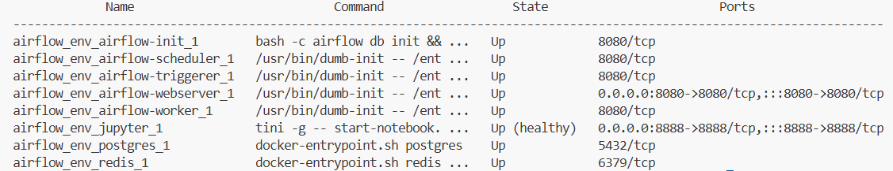

# 구조
```
advanced_project/
│
├── airflow_env/              (Airflow 환경)
│   ├── dags/
│   │   └── my_dag.py
│   ├── plugins/
│   ├── config/                (옵션: key.json 같은 config)
│   ├── .env
│   ├── docker-compose.yml
│   ├── Dockerfile             (Airflow 전용 Dockerfile)
│
├── notebooks/                 (Jupyter 작업 폴더)
│   └── eda.ipynb              (EDA 작업용 노트북 등)
│
├── README.md
├── requirements.txt
└── .gitignore
```

## 어떤 과정을 지나왔는가?
0. 가상환경 켜기
```bash
source .venv/bin/activate
```

1. docker-compose up 으로 실행
```bash
cd advanced_project/airflow_env(해당 경로로 이동한 후에)
# 1. Airflow 초기화 (최초 1회)
docker-compose run airflow-init

# 2. 전체 실행
docker-compose up -d
```
- 문제 및 해결
    - 해당 부분에서 권한 문제
        ```bash
        PermissionError: [Errno 13] Permission denied
        ```
    - 해결
        ```bash
        sudo docker-compose run airflow-init
        sudo docker-compose up -d
        ```
    - 문제 container 키 오류
        ```bash
        KeyError: 'ContainerConfig'
        ```
    - 해결
        ```bash
        # 모든 컨테이너 정지 및 삭제
        sudo docker-compose down --volumes --remove-orphans

        # 캐시된 이미지 중단
        sudo docker image prune -a -f

        # airflow-init 먼저
        sudo docker-compose run airflow-init

        # 전체 서비스 실행
        sudo docker-compose up -d
        ```

2. docker container 정상 확인
```bash
sudo docker-compose ps
```
아래와 같다면 제대로 정상


3. 접속
- airflow
브라우저에서 http://"각자의 인스턴스 외부 ip":8080
    - 아이디, 비번 : admin, admin
- jupyter
브라우저에서 http://"각자의 인스턴스 외부 ip":8888

- 만약 아이디 비번 변경을 위해서 수동 변경
```bash
sudo docker exec -it airflow_env_airflow-webserver_1 airflow users create \
  --username admin \
  --password admin \
  --firstname Admin \
  --lastname User \
  --role Admin \
  --email admin@example.com
```

4. 임시 dag 제작 후 실행
- check_dag.py 제작 후 실행하여 정상 작동 확인

5. 전처리 코드 종합 진행 중
    - hackle 데이터는 이미 진행된 전처리 포함된 병합 데이터이므로 추가 전처리..고민
    - 진행 예정
    ```txt
    1. GCS 데이터 로드
    2. 데이터 전처리
    3. 전처리한 데이터를 업로드(?)
    ```